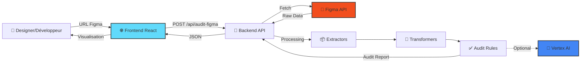
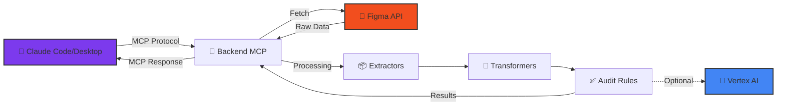
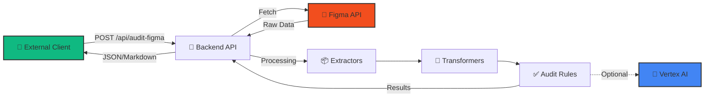
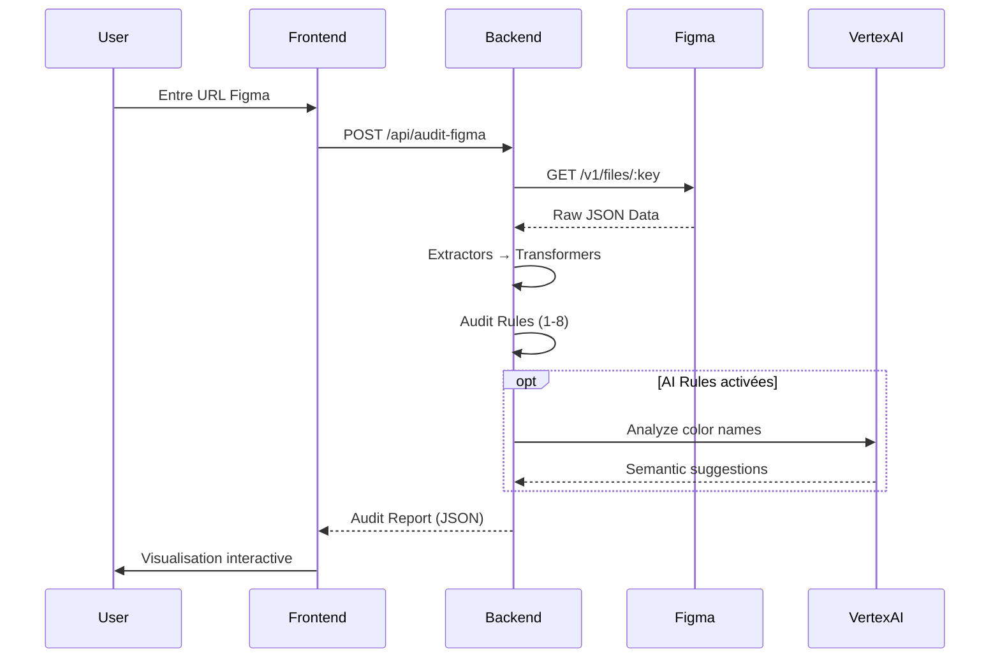
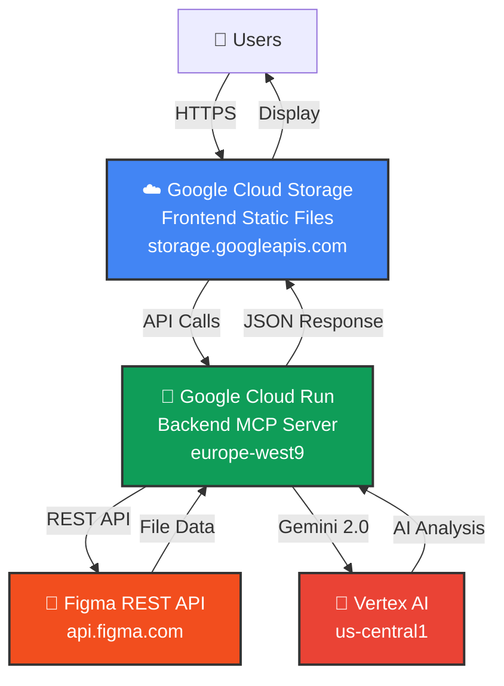

# FigmAudit

<div align="center">

   

**🎨 Plateforme complète d'analyse et d'audit de designs Figma**

Audit automatisé • Extraction de données • Design System • API MCP • Interface web

[⚡ Quick Start](#-quick-start) • [📖 Documentation](#-documentation) • [🏗️ Architecture](#-architecture) • [🌐 Démo](#-démo)

</div>

---

## 📖 Table des matières

- [Vue d'ensemble](#-vue-densemble)
- [Fonctionnalités](#-fonctionnalités)
- [Architecture](#-architecture)
- [Quick Start](#-quick-start)
- [Backend MCP Server](#-backend-mcp-server)
- [Frontend Web App](#-frontend-web-app)
- [Développement](#-développement)
- [Déploiement](#-déploiement)
- [Documentation](#-documentation)
- [FAQ](#-faq)
- [Contribution](#-contribution)

---

## 🎯 Vue d'ensemble

**FigmAudit** est une solution complète pour analyser, auditer et extraire des données depuis des fichiers Figma. Le projet se compose de deux parties complémentaires :

- **Backend** : Serveur MCP (Model Context Protocol) TypeScript avec API REST
- **Frontend** : Interface web React pour visualiser les audits

### 🎭 Trois modes d'utilisation

#### Mode 1 : Interface Web (Recommandé pour designers)



#### Mode 2 : MCP Client (Recommandé pour développeurs)



#### Mode 3 : API REST Directe (Recommandé pour CI/CD)



### ✨ Cas d'usage

| Profil | Besoin | Solution |
|--------|--------|----------|
| **Designer UI/UX** | Vérifier la qualité d'une maquette | Interface web avec rapport visuel |
| **Développeur** | Extraire un design system depuis Figma | MCP Tools via Claude Code |
| **Équipe produit** | Audits automatisés dans CI/CD | API REST endpoint |
| **Consultant** | Analyse de fichiers clients | Interface web (fichiers publics) |

---

## 🚀 Fonctionnalités

### 🔍 Audit de design (8+ règles)

- ✅ **Auto Layout Usage** : Détecte les frames qui devraient utiliser Auto Layout
- ✅ **Layer Naming** : Identifie les noms par défaut (Frame 123, Rectangle 45)
- ✅ **Detached Styles** : Trouve les styles inline non liés au design system
- ✅ **Export Settings** : Vérifie les assets sans configuration d'export
- ✅ **Groups vs Frames** : Analyse l'utilisation appropriée des conteneurs
- ✅ **Component Descriptions** : Vérifie la documentation des composants
- ✅ **Color Contrast (WCAG)** : Analyse l'accessibilité des contrastes
- ✅ **Typography (WCAG)** : Vérifie les tailles de police accessibles
- 🤖 **Color Naming (IA)** : Suggestions sémantiques pour noms de couleurs (optionnel)

### 📊 Visualisation du Design System

- 🎨 **Palette de couleurs** utilisée dans le fichier
- 🔤 **Styles typographiques** (famille, taille, poids)
- 🧩 **Composants** détectés et leur usage
- 📐 **Layouts** et configurations de mise en page

### 💡 Suggestions intelligentes

- Détection automatique de **patterns répétitifs** à componentiser
- Analyse **sémantique des noms** de couleurs avec IA (optionnel)
- Génération de **descriptions contextuelles** de maquettes

### 📥 Extraction de données

- Données **brutes** depuis l'API Figma
- Données **simplifiées** optimisées pour l'analyse
- Téléchargement d'**images** (SVG, PNG @2x)
- Export de **rapports** (JSON, Markdown)

---

## 🏗️ Architecture

### Structure du projet

```
.
├── back/                    # Backend MCP Server
│   ├── src/
│   │   ├── mcp/            # Outils MCP (4 tools)
│   │   ├── services/       # Service Figma API
│   │   ├── extractors/     # Système d'extraction modulaire
│   │   ├── transformers/   # Transformation de données
│   │   ├── server.ts       # Serveur HTTP Express
│   │   └── cli.ts          # Interface CLI stdio
│   ├── readmeDocs/         # Documentation détaillée
│   └── README.md           # Doc backend complète
│
├── front/                   # Frontend React
│   ├── src/
│   │   ├── components/     # Composants React
│   │   ├── contexts/       # AuditContext (état global)
│   │   ├── types/          # Types TypeScript
│   │   └── utils/          # API client
│   ├── .storybook/        # Documentation Storybook
│   └── README.md          # Doc frontend complète
│
├── CLAUDE.md              # Guidelines pour Claude Code
└── package.json           # Scripts workspace racine
```

### Technologies

#### Backend
[](https://www.typescriptlang.org/)
[](https://nodejs.org/)
[](https://expressjs.com/)
[](https://docs.anthropic.com/mcp)
[](https://cloud.google.com/vertex-ai)

#### Frontend
[](https://react.dev/)
[](https://vitejs.dev/)
[](https://tailwindcss.com/)
[](https://www.chartjs.org/)
[](https://storybook.js.org/)

### Flux de données



---

## ⚡ Quick Start

### Prérequis

- **Node.js** >= 18.0.0
- **pnpm** >= 8.0.0
- **Figma API Key** ([obtenir une clé](https://www.figma.com/developers/api#access-tokens))
- *Optionnel* : Google Cloud Project (pour règles IA)

### Installation et lancement (5 minutes)

```bash
# 1. Cloner le repository
git clone https://github.com/GLips/Figma-Context-MCP.git
cd Figma-Context-MCP

# 2. Installer toutes les dépendances
pnpm install:all

# 3. Configurer le backend
cd back
cat > .env << EOF
FIGMA_API_KEY=your_figma_api_key_here
EOF

# 4. (Optionnel) Activer les règles IA
# gcloud auth application-default login
# Ajouter dans .env :
# ENABLE_AI_RULES=true
# GOOGLE_CLOUD_PROJECT=your_project_id

# 5. Build backend
pnpm build

# 6. Lancer le backend (terminal 1)
pnpm start
# ✅ Backend disponible sur http://localhost:3333

# 7. Configurer le frontend (terminal 2)
cd ../front
cat > .env << EOF
VITE_API_BASE_URL=http://localhost:3333
EOF

# 8. Lancer le frontend
pnpm dev
# ✅ Frontend disponible sur http://localhost:5173
```

### Premier audit

1. Ouvrir [http://localhost:5173](http://localhost:5173)
2. Coller une URL Figma (fichier public ou privé avec votre clé API)
3. Cliquer sur "Auditer"
4. Explorer le rapport interactif 🎉

---

## 🔧 Backend MCP Server

### Vue d'ensemble

Le backend est un serveur **TypeScript** qui expose :
- **4 outils MCP** pour Claude Code/Desktop
- **API REST** pour le frontend et clients externes
- **Système d'extraction modulaire** de données Figma

### Modes de fonctionnement

| Mode | Usage | Commande |
|------|-------|----------|
| **HTTP** | API REST, Frontend | `pnpm start` |
| **stdio** | Claude Code MCP | `pnpm start:cli` |

### Outils MCP disponibles

| Outil | Description | Documentation |
|-------|-------------|---------------|
| `get_figma_context` | Extraction simplifiée optimisée | [→ Voir](back/README.md#2-get_figma_context) |
| `audit_figma_design` | Analyse et audit de designs | [→ Voir](back/README.md#3-audit_figma_design) |
| `download_figma_images` | Téléchargement d'assets | [→ Voir](back/README.md#4-download_figma_images) |
| `get_figma_data` | Extraction brute (legacy) | [→ Voir](back/README.md#1-get_figma_data) |

### Configuration MCP (Claude Code)

```bash
# Démarrer le serveur backend
cd back && pnpm start

# Ajouter à Claude Code (HTTP - Recommandé)
claude mcp add --transport http figma-mcp http://localhost:3333/mcp
```

### API REST

#### `POST /api/audit-figma`

```bash
curl -X POST http://localhost:3333/api/audit-figma \
  -H "Content-Type: application/json" \
  -d '{
    "figmaUrl": "https://www.figma.com/file/abc123/MyDesign",
    "figmaApiKey": "your_api_key",
    "outputFormat": "json"
  }'
```

**📚 Documentation complète** : [back/README.md](back/README.md)

---

## 🌐 Frontend Web App

### Vue d'ensemble

Interface **React + TypeScript** pour auditer des designs Figma via une interface intuitive.

### Fonctionnalités

- 📋 **Formulaire d'audit** : URL Figma + clé API (optionnelle)
- 📊 **Statistiques visuelles** : Graphique Chart.js des règles violées
- 📑 **Tableau détaillé** : Liste des problèmes par élément
- 🎨 **Design System Viewer** : Couleurs, typographies, composants
- 💡 **Suggestions de composants** : Patterns détectés automatiquement
- 📖 **Documentation des règles** : Conseils de résolution intégrés

### Développement

```bash
cd front

# Serveur de développement
pnpm dev
# → http://localhost:5173

# Tests unitaires (Vitest)
pnpm test

# Storybook (documentation des composants)
pnpm storybook
# → http://localhost:6006

# Build de production
pnpm build
```

### Composants principaux

- **InputForm** : Formulaire de saisie URL + API key
- **StatsCards** : Cartes statistiques avec graphique
- **DetailedTables** : Tableau détaillé des résultats
- **DesignSystemViewer** : Visualisation du design system
- **ComponentSuggestionsCards** : Suggestions de composants

**📚 Documentation complète** : [front/README.md](front/README.md)

---

## 💻 Développement

### Scripts workspace racine

```bash
# Installation
pnpm install:all              # Installer back + front

# Build
pnpm build:back               # Build backend
pnpm build:front              # Build frontend

# Développement
pnpm dev:back                 # Backend en watch mode
pnpm dev:front                # Frontend en watch mode

# Tests
pnpm test:back                # Tests backend (Jest)
pnpm test:front               # Tests frontend (Vitest)

# Qualité du code
pnpm lint:back                # Linting backend
pnpm lint:front               # Linting frontend
```

### Workflow typique

#### Feature Backend (nouvelle règle d'audit)

```bash
cd back

# 1. Créer la règle dans src/mcp/tools/audit-figma-design/rules/
# 2. Enregistrer dans rules-registry.ts
# 3. Écrire les tests
pnpm test

# 4. Build et lancement
pnpm build && pnpm start
```

#### Feature Frontend (nouveau composant)

```bash
cd front

# 1. Créer le composant dans src/components/
# 2. Créer MyComponent.test.tsx
# 3. Créer MyComponent.stories.tsx
pnpm test

# 4. Vérifier dans Storybook
pnpm storybook
```

#### Feature Fullstack (nouvelle visualisation)

```bash
# 1. Backend : Ajouter/modifier les données de l'audit
cd back
pnpm build && pnpm start

# 2. Frontend : Créer le composant de visualisation
cd ../front
pnpm dev

# 3. Tester l'intégration complète
```

---

## 🚀 Déploiement

### 🌐 Démo

- **Frontend** : [https://storage.googleapis.com/figma-mcp-frontend/index.html](https://storage.googleapis.com/figma-mcp-frontend/index.html)
- **Backend** : [https://figma-mcp-server-1045310654832.europe-west9.run.app](https://figma-mcp-server-1045310654832.europe-west9.run.app)

### Architecture production



### Déploiement automatique

Le projet utilise **Cloud Build** avec triggers automatiques :
- Push sur `main` → Déploiement backend Cloud Run
- Push sur `main` → Déploiement frontend Cloud Storage

**📚 Documentation complète** : [back/readmeDocs/DEPLOYMENT.md](back/readmeDocs/DEPLOYMENT.md)

---

## 📚 Documentation

### Documentation générale

- [CLAUDE.md](CLAUDE.md) - Guidelines pour Claude Code (développement assisté par IA)

### Documentation Backend

- [back/README.md](back/README.md) - Documentation complète du backend
- [back/readmeDocs/INSTALLATION.md](back/readmeDocs/INSTALLATION.md) - Installation et configuration
- [back/readmeDocs/DEPLOYMENT.md](back/readmeDocs/DEPLOYMENT.md) - Déploiement sur Cloud Run
- [back/readmeDocs/AUDIT_RULES.md](back/readmeDocs/AUDIT_RULES.md) - Détails des règles d'audit
- [back/src/extractors/README.md](back/src/extractors/README.md) - Système d'extractors

### Documentation Frontend

- [front/README.md](front/README.md) - Documentation complète du frontend
- Guide du développeur frontend (intégré dans front/README.md)
- Storybook : `cd front && pnpm storybook`

### Liens externes

- [Documentation MCP](https://docs.anthropic.com/mcp)
- [API REST Figma](https://www.figma.com/developers/api)
- [Google Cloud Vertex AI](https://cloud.google.com/vertex-ai/docs)
- [WCAG 2.1 Guidelines](https://www.w3.org/WAI/WCAG21/quickref/)

---

## ❓ FAQ

<details>
<summary><strong>Puis-je utiliser l'application sans clé Figma API ?</strong></summary>

<br>

**Oui**, mais uniquement pour les **fichiers publics**. Pour les fichiers privés, vous devez fournir une clé API Figma valide.

</details>

<details>
<summary><strong>Comment activer les règles IA ?</strong></summary>

<br>

Les règles IA sont **désactivées par défaut**. Pour les activer :

1. Configurez Application Default Credentials :
```bash
gcloud auth application-default login
```

2. Ajoutez dans `back/.env` :
```env
ENABLE_AI_RULES=true
GOOGLE_CLOUD_PROJECT=your_project_id
```

3. Relancez le backend :
```bash
cd back && pnpm start
```

> **Note** : Nécessite un projet Google Cloud avec Vertex AI activé.

</details>

<details>
<summary><strong>Quelle est la différence entre les outils MCP ?</strong></summary>

<br>

| Outil | Usage principal |
|-------|----------------|
| `get_figma_context` | **Principal** : Extraction optimisée pour 99% des cas |
| `audit_figma_design` | Audit complet avec règles de bonnes pratiques |
| `download_figma_images` | Téléchargement d'assets pour intégration |
| `get_figma_data` | Accès direct aux données brutes (legacy) |

> **Recommandation** : Utilisez `get_figma_context` puis `audit_figma_design`.

</details>

<details>
<summary><strong>Le projet fonctionne-t-il sur Windows ?</strong></summary>

<br>

**Oui** ! Le projet fonctionne sur Windows, macOS et Linux. Les chemins Windows (`\`) et Unix (`/`) sont supportés.

</details>

<details>
<summary><strong>Puis-je contribuer au projet ?</strong></summary>

<br>

Oui ! Les contributions sont bienvenues. Voir la section [Contribution](#-contribution) ci-dessous.

</details>

<details>
<summary><strong>Quelles sont les limites du système ?</strong></summary>

<br>

| Aspect | Limite indicative | Notes |
|--------|-------------------|-------|
| **Taille fichiers Figma** | ~10 000 nodes | Temps de traitement augmente |
| **Rate limiting Figma** | 15 req/min | Limite API Figma par token |
| **Timeout LLM** | ~30s | Pour règles IA sur gros fichiers |

> Des limites formelles seront définies après tests de charge.

</details>

---

## 🤝 Contribution

Les contributions sont les bienvenues ! Pour le moment, aucun workflow formel n'est défini.

### Pour contribuer

1. Forkez le projet
2. Créez une branche pour votre feature (`git checkout -b feature/amazing-feature`)
3. Committez vos changements (`git commit -m 'Add amazing feature'`)
4. Poussez vers la branche (`git push origin feature/amazing-feature`)
5. Ouvrez une Pull Request

### Guidelines

- **Backend** : Suivre les conventions dans [CLAUDE.md](CLAUDE.md)
- **Frontend** : Suivre le guide développeur dans [front/README.md](front/README.md)
- **Tests** : Ajouter des tests pour toute nouvelle fonctionnalité
- **Documentation** : Mettre à jour les README si nécessaire

---

## 📄 Licence

MIT License - Voir le fichier [LICENSE](LICENSE) pour plus de détails.

---

## 🔗 Liens rapides

- **Repository** : [https://github.com/GLips/Figma-Context-MCP](https://github.com/GLips/Figma-Context-MCP)
- **Homepage** : [https://www.framelink.ai](https://www.framelink.ai)
- **Issues** : [https://github.com/GLips/Figma-Context-MCP/issues](https://github.com/GLips/Figma-Context-MCP/issues)

---

<div align="center">

**Développé avec ❤️ pour améliorer la qualité des designs Figma**

⭐ Si ce projet vous aide, n'hésitez pas à lui donner une étoile !

</div>
