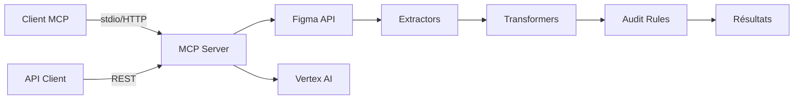

# Figma MCP Backend

<div align="center">

    

**🎨 Serveur MCP TypeScript pour l'analyse et l'extraction de données Figma**

Analyse automatique • Audit de design • Extraction de données • Design System

[⚡ Quick Start](#-quick-start) • [📚 Documentation](#-documentation-complète) • [🛠️ API](#-outils-mcp) • [❓ FAQ](#-faq)

</div>

---

## 📖 Table des matières

- [Vue d'ensemble](#-vue-densemble)
- [Quick Start](#-quick-start)
- [Architecture](#-architecture)
- [Outils MCP](#-outils-mcp)
- [Développement](#-développement)
- [Tests](#-tests)
- [Documentation complète](#-documentation-complète)
- [Exemples d'usage](#-exemples-dusage)
- [FAQ](#-faq)

---

## 🎯 Vue d'ensemble

Ce projet est un serveur backend **MCP (Model Context Protocol)** qui fournit des outils pour analyser et extraire des données depuis des fichiers Figma. Il peut fonctionner en **deux modes** :



### Modes de fonctionnement

| Mode | Usage | Avantages |
|------|-------|-----------|
| **stdio** | Clients MCP (Claude Desktop, VS Code) | Intégration directe |
| **HTTP** | API REST, Claude Code | Stabilité, Rechargement à chaud |

### ✨ Fonctionnalités principales

- 📊 **Extraction de données** Figma (brutes et simplifiées)
- 🔍 **Audit automatisé** de designs avec 8+ règles personnalisables
- 🏷️ **Détection de problèmes** (nommage, Auto Layout, styles détachés, etc.)
- 💡 **Suggestions de composants** à créer
- 🎨 **Analyse du Design System** (couleurs, typographie, composants)
- 📥 **Téléchargement d'images** et screenshots
- 🤖 **Support de l'IA** pour des règles avancées (optionnel)

---

## ⚡ Quick Start

### Installation rapide (5 minutes)

```bash
# 1. Installation des dépendances
cd back && pnpm install

# 2. Configuration minimale
cat > .env << EOF
FIGMA_API_KEY=your_figma_api_key
GOOGLE_CLOUD_PROJECT=your_project_id
EOF

# 3. Configuration ADC (pour l'IA)
gcloud auth application-default login

# 4. Build et lancement
pnpm build
pnpm start
```

Votre serveur est maintenant disponible sur `http://localhost:3333` 🎉

### Ajout à Claude Code (HTTP - Recommandé)

```bash
# Le serveur doit être lancé
pnpm start

# Dans un autre terminal
claude mcp add --transport http figma-mcp http://localhost:3333/mcp
```

> [!TIP]
> Le mode HTTP est **plus stable et pratique** que stdio : rechargement à chaud, meilleure gestion des erreurs, pas de problèmes de buffer.

**➡️ Besoin de plus de détails ?** Voir [📥 Guide d'installation complet](readmeDocs/INSTALLATION.md)

---

## 🏗️ Architecture

### Structure simplifiée du projet

```
back/
├── src/
│   ├── mcp/
│   │   ├── tools/              # 4 outils MCP
│   │   │   ├── get-figma-data-tool.ts
│   │   │   ├── get-figma-context/
│   │   │   ├── audit-figma-design/      # Outil d'audit principal
│   │   │   │   ├── audit-figma-design-tool.ts
│   │   │   │   ├── rules-registry.ts    # Registre centralisé des règles
│   │   │   │   ├── types.ts
│   │   │   │   ├── __fixtures__/
│   │   │   │   │   └── sampleData.json
│   │   │   │   ├── sample-data/
│   │   │   │   │   ├── rawData.json
│   │   │   │   │   └── sampleData.json
│   │   │   │   ├── detectors/
│   │   │   │   │   └── pattern-detector.ts    # Détection de patterns
│   │   │   │   ├── generators/
│   │   │   │   │   └── figma-description-generator.ts  # Génération IA
│   │   │   │   └── rules/              # 8 règles d'audit
│   │   │   │       ├── check-auto-layout-usage.ts
│   │   │   │       ├── check-layer-naming.ts
│   │   │   │       ├── check-detached-styles.ts
│   │   │   │       ├── check-export-settings.ts
│   │   │   │       ├── check-group-vs-frame.ts
│   │   │   │       ├── check-component-descriptions.ts
│   │   │   │       ├── check-color-contrast.ts
│   │   │   │       ├── check-typography.ts
│   │   │   │       └── check-color-names.ts    # Règle IA
│   │   │   └── download-figma-images-tool.ts
│   │   └── index.ts            # Enregistrement des outils
│   ├── services/
│   │   └── figma.ts            # Service API Figma
│   ├── extractors/             # Système d'extraction modulaire
│   ├── transformers/           # Transformation des données
│   ├── utils/                  # Utilitaires
│   ├── server.ts               # Point d'entrée HTTP
│   └── cli.ts                  # Point d'entrée CLI
├── readmeDocs/                 # Documentation détaillée
│   ├── INSTALLATION.md
│   ├── DEPLOYMENT.md
│   └── AUDIT_RULES.md
├── Dockerfile                  # Configuration Docker
└── cloudbuild.yaml             # Pipeline Cloud Build
```

### Points d'entrée

1. **`src/server.ts`** (principal) → Serveur HTTP Express + MCP
2. **`src/cli.ts`** → Interface CLI
3. **`src/mcp/index.ts`** → Configuration des outils MCP

### Système d'extractors modulaire

Le projet utilise un système d'extraction flexible :

- **`layoutExtractor`** : Position, sizing, flex
- **`textExtractor`** : Contenu et typographie
- **`visualsExtractor`** : Fills, strokes, effets
- **`componentExtractor`** : Instances de composants

**Combinaisons prédéfinies** : `allExtractors`, `layoutAndText`, `contentOnly`, `visualsOnly`, `layoutOnly`

📖 [Documentation complète des extractors](./src/extractors/README.md)

---

## 🛠️ Outils MCP

Le serveur expose **4 outils MCP** pour interagir avec Figma :

| Outil | Usage | Niveau | Documentation |
|-------|-------|--------|---------------|
| `get_figma_context` | Extraction simplifiée optimisée | ⭐⭐⭐ **Principal** | [→ Voir](#2-get_figma_context) |
| `audit_figma_design` | Analyse et audit de designs | ⭐⭐⭐ Recommandé | [→ Voir](#3-audit_figma_design) |
| `download_figma_images` | Téléchargement d'assets | ⭐⭐ Utilitaire | [→ Voir](#4-download_figma_images) |
| `get_figma_data` | Extraction brute (legacy) | ⭐ Avancé | [→ Voir](#1-get_figma_data) |

---

### 1. `get_figma_data` (Extraction brute)

> [!NOTE]
> Cet outil fournit un accès direct aux données Figma brutes sans transformation. Pour la plupart des cas d'usage, préférez `get_figma_context`.

**Paramètres** :
```typescript
{
  fileKey: string;      // Clé du fichier Figma (obligatoire)
  nodeId?: string;      // ID d'un nœud spécifique
  depth?: number;       // Profondeur de traversée
}
```

**Cas d'usage** : Accès aux données brutes pour analyse personnalisée.

<details>
<summary>Voir l'exemple de code</summary>

```typescript
// Exemple MCP
get_figma_data({
  fileKey: "abc123def456",
  nodeId: "0:1"
})
```

</details>

---

### 2. `get_figma_context` (Extraction simplifiée - **Principal outil**)

> [!IMPORTANT]
> **C'est l'outil principal** utilisé pour préparer les données avant l'audit. Il retourne une version optimisée et simplifiée de la structure.

**Paramètres** :
```typescript
{
  url: string;          // URL complète du fichier Figma (obligatoire)
  scope?: "auto" | "file" | "page" | "node";  // Portée de l'analyse
}
```

**Fonctionnalités** :
- ✅ Extraction optimisée et simplifiée
- ✅ Détection automatique du scope (file/page/node)
- ✅ Filtrage des données inutiles
- ✅ Préparation pour l'audit

<details>
<summary>Voir l'exemple de code</summary>

```typescript
// Exemple MCP
get_figma_context({
  url: "https://www.figma.com/file/abc123def456/MyDesign?node-id=10:234",
  scope: "auto"  // Détecte automatiquement si c'est un file, page ou node
})
```

**Réponse** : Structure simplifiée avec layout, texte, styles, composants.

</details>

---

### 3. `audit_figma_design` (Analyse et audit)

> [!TIP]
> Utilisez cet outil pour analyser une maquette Figma avec **8+ règles de bonnes pratiques** et obtenir des suggestions d'amélioration.

**Paramètres** :
```typescript
{
  figmaDataJson: string;        // Données de get_figma_context (obligatoire)
  outputFormat?: "json" | "markdown";  // Format de sortie (défaut: json)
}
```

**Fonctionnalités** :
- 🔍 **8+ règles d'audit** (Auto Layout, nommage, styles, accessibilité, etc.)
- 🎨 **Visualisation du Design System** (couleurs, typo, composants)
- 💡 **Suggestions de composants** à créer (détection de patterns)
- 🤖 **Règles IA optionnelles** (analyse sémantique des couleurs)

**Règles d'audit** :
- ✅ Auto Layout Usage
- ✅ Layer Naming
- ✅ Detached Styles
- ✅ Export Settings
- ✅ Groups vs Frames
- ✅ Component Descriptions
- ✅ Color Contrast (WCAG)
- ✅ Typography (WCAG)
- 🤖 Color Naming (IA)

📖 [Documentation complète des règles](readmeDocs/AUDIT_RULES.md)

<details>
<summary>Voir l'exemple de code</summary>

```typescript
// Étape 1 : Extraction
const contextData = get_figma_context({
  url: "https://www.figma.com/file/abc/MyDesign"
});

// Étape 2 : Audit
audit_figma_design({
  figmaDataJson: JSON.stringify(contextData),
  outputFormat: "json"
})
```

**Réponse** :
```json
{
  "rulesDefinitions": [...],
  "results": [...],
  "designSystem": {
    "colors": [...],
    "typography": [...],
    "components": [...]
  },
  "componentSuggestions": [...]
}
```

</details>

---

### 4. `download_figma_images` (Téléchargement d'images)

**Paramètres** :
```typescript
{
  fileKey: string;        // Clé du fichier Figma (obligatoire)
  nodes: Array<{          // Liste des nœuds à télécharger (obligatoire)
    nodeId: string;
    fileName: string;     // Nom du fichier avec extension (.svg, .png)
  }>;
  localPath: string;      // Chemin local de destination (obligatoire)
  pngScale?: number;      // Échelle pour PNG (défaut: 2)
}
```

**Cas d'usage** : Récupération d'assets pour intégration dans un projet.

<details>
<summary>Voir l'exemple de code</summary>

```typescript
download_figma_images({
  fileKey: "abc123def456",
  localPath: "C:\\Users\\me\\assets",
  nodes: [
    { nodeId: "2:39", fileName: "icon-home.svg" },
    { nodeId: "2:40", fileName: "icon-user.png" }
  ],
  pngScale: 2  // @2x pour retina
})
```

</details>

---

## 🌐 API REST

En mode HTTP, le serveur expose également une **API REST**.

### `POST /api/audit-figma`

Endpoint pour auditer un design Figma sans utiliser le protocole MCP.

**Request** :
```bash
curl -X POST http://localhost:3333/api/audit-figma \
  -H "Content-Type: application/json" \
  -d '{
    "figmaUrl": "https://www.figma.com/file/abc123/MyDesign",
    "figmaApiKey": "your_api_key",  // Optionnel pour fichiers publics
    "outputFormat": "json"
  }'
```

**Responses** :
- ✅ `200 OK` : Audit réussi
- ❌ `400 Bad Request` : URL manquante ou invalide
- ❌ `401 Unauthorized` : Fichier privé sans clé API valide
- ❌ `500 Internal Server Error` : Erreur de traitement

---

## 💻 Développement

### Commandes disponibles

<details open>
<summary><strong>📦 Build et développement</strong></summary>

```bash
pnpm build          # Build TypeScript avec déclarations de types
pnpm type-check     # Type checking sans émission
pnpm dev            # Développement avec watch et rebuild automatique
pnpm dev:cli        # Développement en mode CLI stdio (pour MCP)
```

</details>

<details>
<summary><strong>🧪 Tests</strong></summary>

```bash
pnpm test           # Lancer tous les tests
pnpm test:watch     # Tests en mode watch (interactif)
pnpm test:ui        # Tests avec interface UI (Vitest UI)
pnpm test:coverage  # Tests avec couverture de code
```

</details>

<details>
<summary><strong>✨ Qualité du code</strong></summary>

```bash
pnpm lint           # Linting avec ESLint
pnpm format         # Formatage du code avec Prettier
```

</details>

<details>
<summary><strong>🚀 Lancement du serveur</strong></summary>

```bash
pnpm start          # Démarrer le serveur (HTTP mode par défaut)
pnpm start:cli      # Démarrer en mode CLI stdio (pour MCP)
pnpm start:http     # Démarrer en mode HTTP explicite
```

</details>

<details>
<summary><strong>🐛 Debugging</strong></summary>

```bash
pnpm inspect        # Inspecter les connexions MCP (mode interactif)
```

</details>

### Mode de développement

**Développement HTTP** (recommandé) :
```bash
pnpm dev
# Serveur disponible sur http://localhost:3333
```

**Développement MCP stdio** :
```bash
pnpm dev:cli
```

> [!TIP]
> Le serveur se recharge automatiquement lors des modifications de fichiers en mode `dev`.

---

## 🧪 Tests

### Couverture actuelle

- **~80%** du code couvert
- Tests unitaires (pas d'intégration pour le moment)
- Framework : **Vitest**

### Lancer les tests

```bash
# Tous les tests
pnpm test

# Mode watch (recommandé en dev)
pnpm test:watch

# Avec interface UI
pnpm test:ui
```

### Données de test

Des exemples de données sont disponibles pour les tests :

- **Données brutes** : `src/mcp/tools/get-figma-context/__fixtures__/rawData.json`
- **Données simplifiées** : `src/mcp/tools/audit-figma-design/sample-data/sampleData.json`
- **Résultat d'audit** : `../front/sampleData/sampleAuditResult.json`

---

## 📚 Documentation complète

<table>
<tr>
<td width="50%">

### 📥 Installation & Configuration
Guide complet d'installation, configuration des variables d'environnement, et setup MCP.

[→ Lire le guide](readmeDocs/INSTALLATION.md)

</td>
<td width="50%">

### 🚀 Déploiement
Déploiement automatique sur Cloud Run, configuration Docker, monitoring.

[→ Lire le guide](readmeDocs/DEPLOYMENT.md)

</td>
</tr>
<tr>
<td width="50%">

### 🔍 Règles d'audit
Documentation complète des 8+ règles de bonnes pratiques Figma.

[→ Lire le guide](readmeDocs/AUDIT_RULES.md)

</td>
<td width="50%">

### 🧩 Système d'extractors
Architecture modulaire pour l'extraction de données Figma.

[→ Lire le guide](./src/extractors/README.md)

</td>
</tr>
</table>

---

## 💡 Exemples d'usage

### Cas 1 : Audit rapide d'une maquette (API REST)

```bash
curl -X POST http://localhost:3333/api/audit-figma \
  -H "Content-Type: application/json" \
  -d '{
    "figmaUrl": "https://www.figma.com/file/abc123/MyDesign"
  }'
```

> [!NOTE]
> Fonctionne sans clé API pour les fichiers publics.

---

### Cas 2 : Extraction pour analyse de contenu (MCP)

```typescript
// Via un client MCP (Claude Code, Claude Desktop)
get_figma_context({
  url: "https://www.figma.com/file/abc123/MyDesign",
  scope: "page"  // Extraire une page spécifique
})
```

---

### Cas 3 : Téléchargement d'assets pour intégration

```typescript
// Télécharger tous les icônes d'un design system
download_figma_images({
  fileKey: "abc123def456",
  localPath: "./src/assets/icons",
  nodes: [
    { nodeId: "2:39", fileName: "icon-home.svg" },
    { nodeId: "2:40", fileName: "icon-user.svg" },
    { nodeId: "2:41", fileName: "icon-settings.svg" }
  ]
})
```

---

### Cas 4 : Analyse complète du Design System

```typescript
// Étape 1 : Extraction du fichier complet
const data = get_figma_context({
  url: "https://www.figma.com/file/abc/DesignSystem",
  scope: "file"
});

// Étape 2 : Audit avec règles IA activées
audit_figma_design({
  figmaDataJson: JSON.stringify(data),
  outputFormat: "json"
});

// Résultat : Rapport complet avec :
// - Règles violées
// - Design System (couleurs, typo, composants)
// - Suggestions de composants à créer
// - Analyse sémantique des noms de couleurs (IA)
```

---

## ❓ FAQ

<details>
<summary><strong>Quelle est la différence entre <code>get_figma_data</code> et <code>get_figma_context</code> ?</strong></summary>

<br>

| Outil | Données | Usage |
|-------|---------|-------|
| `get_figma_data` | Brutes (API Figma) | Accès direct, analyse personnalisée |
| `get_figma_context` | Simplifiées et optimisées | **Principal outil**, prépare l'audit |

> [!TIP]
> **Recommandation** : Utilisez `get_figma_context` pour 99% des cas. `get_figma_data` pourrait être déprécié à l'avenir.

</details>

<details>
<summary><strong>Comment activer les règles IA ?</strong></summary>

<br>

Les règles IA sont **désactivées par défaut** pour des raisons de coût et de performance.

**Pour activer** :

1. Configurez ADC :
```bash
gcloud auth application-default login
```

2. Ajoutez dans votre `.env` :
```bash
ENABLE_AI_RULES=true
GOOGLE_CLOUD_PROJECT=your_project_id
```

3. Relancez le serveur :
```bash
pnpm start
```

> [!IMPORTANT]
> Nécessite un projet Google Cloud avec Vertex AI activé.

</details>

<details>
<summary><strong>Puis-je utiliser l'API sans clé Figma ?</strong></summary>

<br>

**Oui**, mais uniquement pour les **fichiers publics**.

Pour les fichiers privés, vous recevrez :
```json
{
  "error": "Accès refusé au fichier Figma",
  "details": "Ce fichier n'est pas public. Veuillez fournir une clé API Figma valide.",
  "suggestion": "Obtenez une clé API sur https://www.figma.com/developers/api#access-tokens"
}
```

</details>

<details>
<summary><strong>Quelles sont les limites du système ?</strong></summary>

<br>

Actuellement, aucune limite stricte n'est imposée, mais voici des considérations :

| Aspect | Limite indicative | Notes |
|--------|-------------------|-------|
| **Taille fichiers Figma** | ~10 000 nodes | Temps de traitement augmente |
| **Rate limiting Figma** | 15 req/min | Limite API Figma par token |
| **Timeout LLM** | ~30s | Pour règles IA sur gros fichiers |

> [!NOTE]
> Des limites formelles seront définies après tests de charge. N'hésitez pas à ouvrir une issue pour vos cas d'usage.

</details>

<details>
<summary><strong>Comment déboguer les connexions MCP ?</strong></summary>

<br>

Utilisez l'outil d'inspection MCP :

```bash
pnpm inspect
```

Cet outil vous permet de :
- ✅ Tester les connexions MCP
- ✅ Appeler les outils de manière interactive
- ✅ Voir les requêtes/réponses en temps réel

</details>

<details>
<summary><strong>Le serveur fonctionne-t-il sur Windows ?</strong></summary>

<br>

**Oui** ! Le serveur fonctionne sur Windows, macOS et Linux.

**Note pour Windows** : Les chemins avec `\` et `/` sont tous deux supportés.

```bash
# Windows
localPath: "C:\\Users\\me\\assets"

# Fonctionne aussi
localPath: "C:/Users/me/assets"
```

</details>

<details>
<summary><strong>Pourquoi choisir HTTP plutôt que stdio pour Claude Code ?</strong></summary>

<br>

| Aspect | HTTP | stdio |
|--------|------|-------|
| **Stabilité** | ✅ Excellent | ⚠️ Peut avoir des problèmes de buffer |
| **Rechargement** | ✅ À chaud sans redémarrer | ❌ Nécessite redémarrage de Claude |
| **Gestion erreurs** | ✅ Meilleure | ⚠️ Plus complexe |
| **Debugging** | ✅ Plus facile (logs HTTP) | ⚠️ Plus difficile |

> [!TIP]
> **Recommandation** : Utilisez HTTP pour Claude Code, stdio uniquement pour Claude Desktop/VS Code.

</details>

---

## 🤝 Contribution

Les contributions sont les bienvenues ! Pour le moment, aucun workflow formel n'est défini.

**Pour contribuer** :
1. Forkez le projet
2. Créez une branche pour votre feature
3. Committez vos changements
4. Ouvrez une Pull Request

> [!NOTE]
> Des guidelines détaillées seront ajoutées prochainement.

---

## 📄 Licence

MIT (à confirmer)

---

## 🔗 Liens utiles

- [Documentation MCP](https://docs.anthropic.com/mcp)
- [API REST Figma](https://www.figma.com/developers/api)
- [Google Cloud Vertex AI](https://cloud.google.com/vertex-ai/docs)
- [WCAG 2.1 Guidelines](https://www.w3.org/WAI/WCAG21/quickref/)

---

<div align="center">

**Maintenu par** : [Votre nom/équipe]

**Questions ?** : Ouvrez une [issue sur GitHub](https://github.com/your-repo/issues) ou consultez la [FAQ](#-faq)

⭐ Si ce projet vous aide, n'hésitez pas à lui donner une étoile !

</div>
